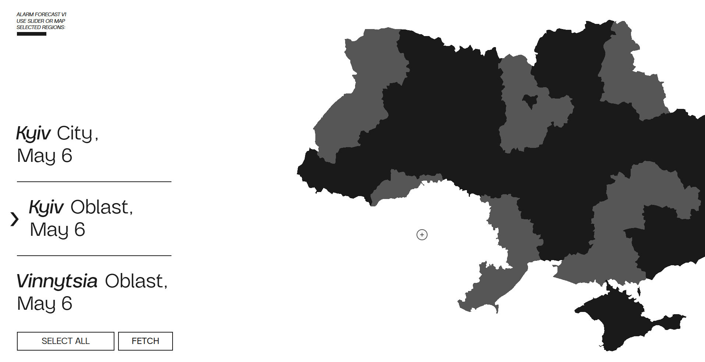
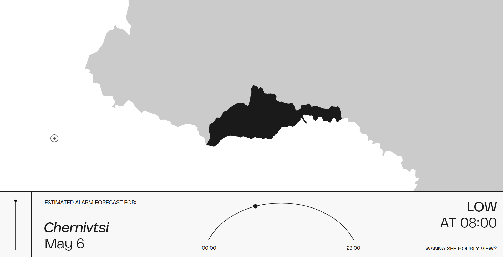

# Ukraine Air Raid Forecast System

This project implements an automated system to forecast the likelihood of air raid alarms across various regions of Ukraine on an hourly basis. It serves as a functional tool designed to aid civilians in daily planning by providing advance notice of periods with heightened alarm risk.

**Current Status:** Fully operational, providing daily automated forecasts via UI/API/JSON.

## Overview

The system uses multiple data sources to generate its forecasts:

* **Ukraine Alarm API:** Fetches official historical alarm start/end times.
* **Institute for the Study of War (ISW):** Scrapes daily "Russian Offensive Campaign Assessment" reports.
* **Telegram:** Monitors specific channels (e.g., `@war_monitor`) for relevant activity information.
* **Visual Crossing Weather API:** Retrieves hourly weather forecasts for regional centers.

Data undergoes automated processing, including NLP (TF-IDF + SVD) for text sources and feature engineering for alarm patterns and weather. A tuned HistGradientBoostingClassifier model generates hourly predictions (`is_alarm_active` probability) for the next 24 hours. Forecasts are served via a Flask web application/API and saved daily. Performance is tracked automatically against actual alarm events.

## Features

* **Automated Daily Integration & Processing**: Collects and stores weather, alarm, ISW, and Telegram data daily. Cleans, imputes (esp. weather), and engineers features (lagged/summary stats, time features).  
* **NLP for Text Signals**: Vectorizes ISW and Telegram reports using TF-IDF + TruncatedSVD to extract predictive features.  
* **Optimized Modeling**: Uses a HistGradientBoostingClassifier tuned for high Recall (>0.80) and practical Precision (>0.30); model and scaler stored in DB.  
* **Daily Workflow & Evaluation**: Orchestrates data handling, prediction, and evaluation. Compares forecasts with actuals and logs metrics. Includes a weekly retraining module (prototype).  
* **Forecast Delivery**: Outputs predictions via JSON, REST API, and a web interface.  
* **Modular & Cloud-Based**: Python modules deployed on AWS EC2/RDS.  

## System Architecture

The system uses a modular Python structure hosted on AWS EC2, interacting with an AWS RDS database:

1.  **Data Receivers (`src/data_receiver/`):** Modules for fetching data from external APIs and sources.
2.  **Database Handler (`src/database/`):** Manages all database operations.
3.  **Processing Pipeline (`src/pipeline/`):** Contains scripts for processing each raw data type.
4.  **Forecasting Engine (`src/forecasting/`):** Manages model prediction, daily orchestration, and retraining (prototype).
5.  **Frontend/API (`src/frontend`):** Serves the UI and API. 
6.  **Artifacts (`artifacts/`):** Stores pre-trained NLP components (TF-IDF/SVD).

*(See `docs/` folder for detailed diagrams)*

## Technology Stack

* **Language:** Python 3.8.0
* **Key Libraries:** Pandas, Scikit-learn, NLTK, Flask, Requests, Telethon, mysql-connector-python
* **Infrastructure:** AWS EC2 (compute), AWS RDS (MySQL database), Cron (scheduling)

*(See `requirements.txt` for full list)*

## Setup and Installation

1.  **Prerequisites:**
    *   Python 3.8.0
    *   Git
    *   Access to an AWS account (for deploying EC2/RDS)
    *   MySQL client tools (optional, for direct DB access)

2.  **Clone Repository:**
    ```bash
    git clone https://github.com/teampds2025/Practice_2.git
    ```

3.  **Set Up Virtual Environment:**
    ```bash
    python -m venv venv
    source venv/bin/activate
    ```

4.  **Install Dependencies:**
    ```bash
    pip install -r requirements.txt
    ```

5.  **NLTK Data Download:**
    *   Run a Python interpreter: `python`
    *   Inside the interpreter, run:
        ```python
        import nltk
        nltk.download('stopwords')
        nltk.download('wordnet')
        nltk.download('punkt')
        exit()
        ```

6.  **Configuration:**
    * Create a `.env` file in the project root directory.
    * Add the following environment variables with your credentials:
        ```dotenv
        DB_HOST=your_db_host_address
        DB_NAME=your_db_name
        DB_USER=your_db_username
        DB_PASSWORD=your_db_password
        DB_PORT=3306 

        ALARM_API_KEY=your_ukraine_alarm_api_key
        WEATHER_API_KEY=your_visual_crossing_api_key

        TELEGRAM_API_ID=your_telegram_api_id
        TELEGRAM_API_HASH=your_telegram_api_hash

        ALERTSAPP_TOKEN=your_chosen_secret_token_for_flask_api
        ```

7.  **Database Setup:**
    *   Ensure your RDS instance is running and accessible.
    *   Use the `DatabaseHandler` class to:
        *   Create tables: `db.create_tables()`
        *   Initialize regions: `db.initialize_regions_in_database()`

8.  **Running the System:**
    * **Daily Pipeline:** Run the orchestrator script:
        ```bash
        python -m src.forecasting.daily_forecast_orchestrator
        ```
        *Note: The first run might require Telegram authentication via console input.*
        Schedule this script using `cron` or another task scheduler for automated daily execution.
      
9. **Data Analysis & Modeling Notebooks:**
    *   The repository contains Jupyter notebooks detailing the all operations performed, see `notebooks/`

## Usage

1.  **Automated Daily Run:** Set up a scheduler (`cron`) to run `src.forecasting.daily_forecast_orchestrator` daily.
2.  **Check Output File:** Find the latest forecast JSON in the `data/predictions/` directory.
3.  **Access Web Interface:** Start the Flask app (`src.frontend.alarm_app_v1`)
4.  **Use API Endpoint:** Send a POST request to `/api/v1/alarm-forecast` with a JSON body containing your `ALERTSAPP_TOKEN` and optionally a `region` field. 
5.  **Database Inspection:** Connect to the MySQL database to view raw data, merged features, predictions, models, and metrics directly.

## Example Interface

Here's an example of the web interface displaying the hourly forecast:

<div style="display: flex; justify-content: space-between;">
  
  
</div>

